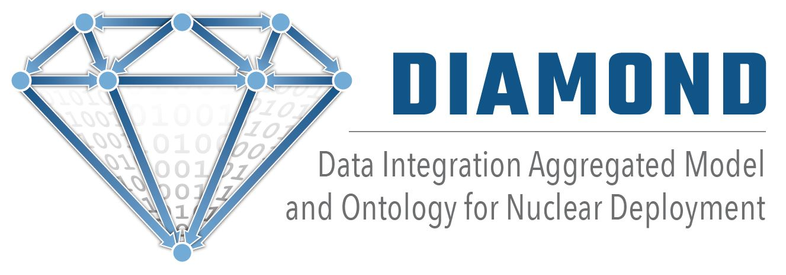

# DIAMOND



[DIAMOND](https://github.com/idaholab/DIAMOND) is a data model that interfaces to the various data sources and functionalities associated with nuclear to ensure a seamless flow of data and their methods. DIAMOND benefits the nuclear power industry by providing a model which can be used by the various applications and data sources within a nuclear power plant (NPP) to standardize a format for data storage and exchange. This enables the creation of a data warehouse within a NPP, providing numerous benefits. These benefits can include:  
* Direct and indirect cost savings through the automation of the manual search for data
* Enable the sharing and comparison of data from various tools from a single or multiple plants
* Enable the digital transformation of data
* Increase frequencies of needed data that are sparse in nature (such as failure signatures)
* Reduce the need for training on various tools for plant staff
* Enable a holistic staff perception of plant activities
* Reveal cost-saving opportunities
* Improve the visual perception of all parts necessary for operations and maintenance  

## Acknowledgements  
**Funding:** Funding for this project was provided by the Department of Energy Light Water Reactor Sustainability program. Additionally, funding for the base ontology research that was leveraged in this work was provided by the Idaho National Laboratory's (INL) Laboratory Directed Research & Development fund.  

**Collarboration:** The authors would like to thank Curtiss Wright for their support on this work.

**Input:** Thank you to Cooper Nuclear Station, Department of Energy Versatile Test Reactor, Electric Power Research Institute, KnowledgeRelay, NextAxiom, Procedure Professionals Association, Palo Verde Generating Station, and Xcel Energy for their valuable inputs.  

**Authors:** Ahmad Al Rashdan (INL), Jeren Browning (INL), and Christopher Ritter (INL)  

## Overview  
****Please Note** that DIAMOND is in development and currently in an **Alpha** state  

DIAMOND is a model for use by applications and processes within and related to nuclear power plants. More specifically, DIAMOND is an ontology. This is because objects are arranged in a hierarchical manner and DIAMOND acts as a taxonomy (in a tree structure) for the NPP domain. Due to its nature as an ontology, research was done into foundational ontologies that could be used to provide an industry-approved skeleton in which to place DIAMOND's nuclear-specific classes. This foundation consists of elements from [Basic Formal Ontology](https://basic-formal-ontology.org/) (BFO) and [Lifecycle Modeling Language](https://www.lifecyclemodeling.org/) (LML). The classes and object properties used from these models in DIAMOND have been indicated through appropriate annotations. Subsets of these models, rather than their entire collections of elements, have been included in DIAMOND. Some of the BFO classes have been relabeled to promote clarity and understanding within the nuclear domain. Original BFO labels can be found in the annotations of these BFO classes, and the IRIs of these classes have not been changed in order to help maintain the BFO structure within DIAMOND and enable the possibility of integration with other ontologies that make use of BFO.  

It may be useful to split an ontology into smaller sections of grouped classes and properties that have common characteristics. In DIAMOND this is referred to as a profile. A profile is used to group data based on a source or process, such as operator rounds, without having to send and parse through the entire ontology. This new subset can then be used for passing data related to that profile. Because the class and property details of the subset are consistent with the main ontology, the subset data is completely interchangeable. Current profiles in use may be found under the `profile_property` annotation and new profile properties should be created and applied in the same manner.

For further information, please see [Additional Resources](#-additional-resources).

## Getting Started  
Working with DIAMOND is as simple as downloading or cloning the DIAMOND [repository](https://github.com/idaholab/DIAMOND). The diamond.owl file may then be viewed through any XML viewer or editor as well as through tools purpose built for the viewing and modification of Web Ontology Language (OWL) files. A list of ontology editors can be found [here](https://www.w3.org/wiki/Ontology_editors).

## Contributing  
DIAMOND is an open source and collaborative effort. We welcome contributions that include additions to the existing classes and data properties. These additions may be needed for purposes such as supporting a new domain of information within a NPP, supporting data needed from some application, or extending the model structure to accomodate additional data within a data source or domain already covered within DIAMOND.  

Applications and processes currently exist which depend on DIAMOND to store and exchange data. Therefore, deletion of any element within DIAMOND is generally inadvisable and elements such as classes or data properties should be marked as deprecated instead, if necessary. Additionally, the object properties used to form relationships between classes have been identified through a careful study of existing standards and it is not believed that the need for additional object properties will be likely. If you feel a new object property is necessary, this change will require extra consideration from the DIAMOND team. The list of available annotations within DIAMOND has also been kept to a standard and necessary set of annotations. The only type of annotation that would generally be added is a new child of profile_property for the labeling of classes within a new profile type. The list of datatypes available is standard and modification will require thorough explanation of why such a change is necessary. The ontology header must not be modified.   

### Code Standards  
When modifying or adding to DIAMOND it is critical to follow the standards specified. In addition to the rules specified above, please closely adhere to the following:  
* A class label should clearly define what object is being represented. In some instances, this may require the use of a term from the parent class label. Examples where this may be needed include children classes of the role, document, or system, classes. For example, the word "role" is included in the class "maintenance role", as using only the label "maintenance" would not provide sufficient clarity of what is inteded.   
* Class labels **must** be unique. When adding a new class, be sure to verify that no other classes exist with the desired name. This can easily be accomplished by opening a find menu and entering the desired class name. This rule also relates to the first, in that it may be necessary to change multiple class names to provide clarity and distinction to each. 
* All classes should be given a minimum set of annotations: rdfs:label, dc:creator, and definition (being 1 to 3 lines long). Other annotations may be used to clarify meaning or edits to the class (example of usage, alternative term, dc:contributor, etc.)  
* Data properties have been organized by datatype: boolean, datetime, enumeration, number, string, uri, and other. Please adhere to this organization.
* Please use the default datatypes, or fully explain the reasoning for needing to use a different datatype. The default types include: xsd:boolean, xsd:dateTimeStamp, xsd:double, xsd:integer, xsd:decimal, xsd:string, and xsd:anyURI.  

To begin contributing to DIAMOND, please open a new Issue on GitHub and describe what you would like to accomplish. This is also a good place to keep track of your edits as you go. Every modification to DIAMOND must reference an issue number. Additionally, every Pull Request should also reference an issue number in its description.  

The first step in modifying DIAMOND is to create your own fork where you can commit your set of changes:

1. Fork DIAMOND  

Navigate to https://github.com/idaholab/DIAMOND  
Click the "Fork" button in the upper right  
Clone your fork to your local machine (replace "username" with your GitHub username):  

`git clone https://github.com/username/DIAMOND.git`  

If this returns "fatal: Unable to find remote helper for 'https'" you might be behind a firewall. Try:

`git clone git@github.com:username/DIAMOND.git`  
 
2. Add the upstream Remote  

Add the real DIAMOND repository as a remote named "upstream":

`cd DIAMOND`  
`git remote add upstream https://github.com/idaholab/DIAMOND.git`  

or, if you had a problem with https,

`cd DIAMOND`  
`git remote add upstream git@github.com:idaholab/DIAMOND.git`  

3. Make Modifications  

Make your modifications and commit them to a branch (be sure to reference an Issue # in your commit messages)  

`git add diamond.owl`  
`git commit -m "A message about the commit, Issue #12345"`  

Note: Please either include all changes in a bulleted list in your commit message (example below) or else refer to an Issue # that contains a list of all changes. 

```
Short Description or Title of PR (less than 50 characters)  
[blank line]  
More detail of your PR if needed.  
 - Bulleted list of changes
 ```

4. Push Modifications Back to GitHub  

Push your branch back into your fork on GitHub:  

`git push origin branch_name`  

5. Create a Pull Request  

GitHub utilizes Pull Requests (PRs) to allow you to submit changes stored in your Fork back to the main DIAMOND repository. Please ensure that all PRs are specified to go to the dev branch.  


## Copyright
[DIAMOND](https://github.com/idaholab/DIAMOND) is Copyright 2020 Battelle Energy Alliance, LLC, under a BSD 3-Clause License.

See [`License.txt`](./License.txt) for the terms of its release.

## Additional Resources
For further information and details around DIAMOND, its development, and standards, please see the [published report](https://lwrs.inl.gov/Advanced%20IIC%20System%20Technologies/DIAMOND_Preliminary_Model_and_Ontology.pdf).

## Contact
Please create a new Issue with details regarding desired changes or udpates to DIAMOND. If needed, please contact Jeren Browning at jeren.browning@inl.gov.